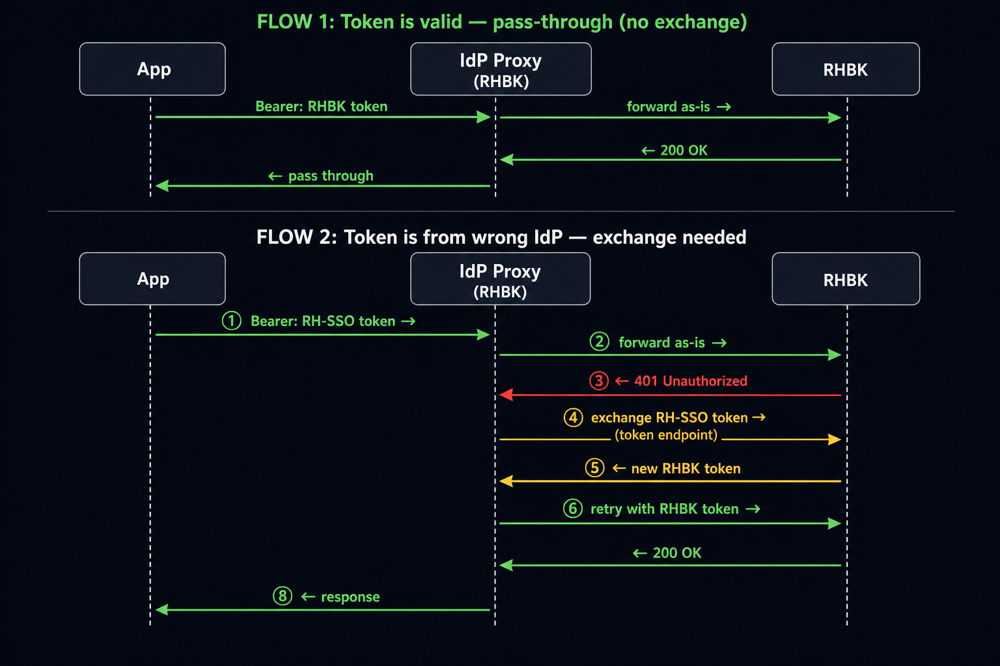
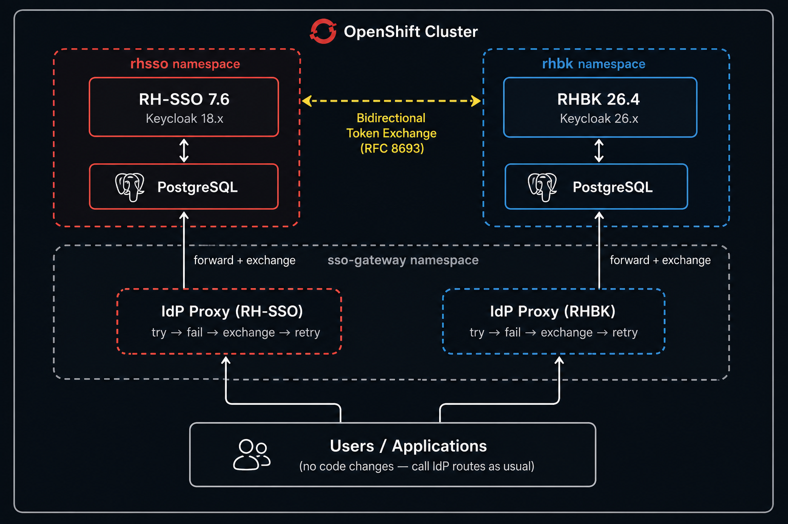

# How We Built a Transparent Token Exchange Proxy for Parallel RH-SSO and RHBK Migration on OpenShift

*A zero-code-change approach to running two identity providers side by side during a gradual Keycloak migration.*

---

## The Problem

A customer came to me with a migration challenge that's becoming increasingly common in the enterprise world: they needed to upgrade from **Red Hat Single Sign-On (RH-SSO) 7.6** to **Red Hat build of Keycloak (RHBK) 26.4**, but they couldn't do it all at once.

Here's the scenario they described:

> **System A** has a client (`client_A`) registered in RH-SSO. When users want to connect, they authenticate against RH-SSO through `client_A` and get a token. Everything works fine.
>
> **System B** doesn't have its own client. Its backend calls `client_A` on RH-SSO, gets a token, and uses it to pull data from System A.
>
> Now, as the RH-SSO admin, I know `client_A` belongs to System A. When I want to upgrade to RHBK, I go to System A's developers and ask them to migrate to RHBK. After the migration, users authenticating to System A go through RHBK — great.
>
> But System B still goes to `client_A` on RH-SSO. It generates a token and tries to access System A — and gets `invalid_token`. The token was issued by RH-SSO, but System A now validates against RHBK.

The customer had dozens of applications in this situation. They couldn't migrate everything simultaneously — the blast radius would be too large. They needed **gradual migration** with **zero code changes** to any application.

The critical constraint: **they couldn't tell us which app uses which client or which IdP.** The teams that wrote the application code couldn't always provide this information. This constraint shaped our entire architecture.

---

## The Initial Solution: Bidirectional Token Exchange

The foundation of the solution is **RFC 8693 Token Exchange** — a standard mechanism where one identity provider can validate a token from another and issue a native token in return.

We established **bidirectional trust** between RH-SSO and RHBK:

- **On RH-SSO:** Added RHBK as an OpenID Connect Identity Provider (alias: `rhbk`), created a dedicated `token-exchange-client` with fine-grained permissions, and enabled the `token_exchange` and `admin_fine_grained_authz` tech-preview features.

- **On RHBK:** Added RH-SSO as an Identity Provider (alias: `rhsso`), created a matching `token-exchange-client`, enabled `preview` and `admin-fine-grained-authz:v1` features, and critically **disabled** `token-exchange-external-internal` (more on this later).

The exchange flow works like this:

```
POST /realms/myrealm/protocol/openid-connect/token
  grant_type=urn:ietf:params:oauth:grant-type:token-exchange
  subject_token=<foreign JWT>
  subject_token_type=urn:ietf:params:oauth:token-type:access_token
  subject_issuer=rhsso    # the alias of the foreign IdP
  client_id=token-exchange-client
  client_secret=<secret>
  scope=openid
```

The target IdP validates the foreign token against its configured IdP trust (checking signatures via JWKS), and if valid, issues a brand new native token.

### The Feature Flag Minefield

Getting the exchange to actually work required navigating a maze of feature flags:

**RH-SSO 7.6** needed two JVM arguments added to the Keycloak CR:

```yaml
keycloakDeploymentSpec:
  experimental:
    env:
      - name: JAVA_OPTS_APPEND
        value: >-
          -Dkeycloak.profile.feature.token_exchange=enabled
          -Dkeycloak.profile.feature.admin_fine_grained_authz=enabled
```

**RHBK 26.4** was trickier. The `admin-fine-grained-authz` feature is a **build-time** Quarkus feature — it's not included in the stock image. We had to set `startOptimized: false` in the Keycloak CR so RHBK would rebuild at startup:

```yaml
spec:
  startOptimized: false
  features:
    enabled:
      - preview
      - admin-fine-grained-authz:v1
    disabled:
      - token-exchange-external-internal
```

The `:v1` suffix on `admin-fine-grained-authz` is critical — without it, the feature silently fails to load in RHBK 26.4.

And `token-exchange-external-internal` (a newer v2 feature) **must be disabled** — it overrides the fine-grained authorization model and breaks the exchange flow. We spent hours debugging "Token not authorized" errors before discovering this conflict.

---

## Evolution 1: The Transparent Proxy (In Front of Apps)

With bidirectional exchange working, the next question was: **who performs the exchange?**

The customer's requirement was zero code changes. Applications shouldn't need to know about the migration. So we built a **transparent reverse proxy** in Python (Flask + Gunicorn) that sits between callers and backend services.

The initial design was straightforward:

1. Configure the proxy with `EXPECTED_ISSUER` — the issuer the backend expects
2. Every incoming request's Bearer token is decoded (without signature verification — that's the IdP's job)
3. If the `iss` claim doesn't match `EXPECTED_ISSUER`, exchange the token
4. Forward the request with the new token

```python
if claims and claims.get("iss") != EXPECTED_ISSUER:
    new_token = exchange_token(token)
    if new_token:
        forwarded_headers["Authorization"] = f"Bearer {new_token}"
```

We deployed one proxy per protected app — `token-proxy-legacy` (in front of apps validating RH-SSO tokens) and `token-proxy-migrated` (in front of apps validating RHBK tokens).

This worked in our POC environment where we controlled everything. But when we took it to the customer...

---

## The Customer's Curveball

At the customer site, we hit the wall we mentioned earlier: **they couldn't map which app uses which client or IdP.** Deploying a proxy in front of each individual application was impractical because:

1. They had dozens of applications across multiple namespaces
2. The application teams couldn't always tell us which SSO client their app used
3. The `EXPECTED_ISSUER` configuration required knowing which IdP each app validates against

We needed a different approach — one that didn't require any per-app knowledge.

---

## Evolution 2: IdP Gateway Mode (In Front of the IdPs)

The breakthrough insight: instead of proxying individual apps, **proxy the IdPs themselves.** Place one proxy in front of RH-SSO and one in front of RHBK. All traffic to either IdP flows through the proxy.

The new approach eliminates `EXPECTED_ISSUER` entirely. Instead of pre-checking the JWT issuer, the proxy uses a **"try-first, exchange-on-failure"** pattern:

1. **Forward the request to the IdP as-is**
2. **If the IdP returns 401/403 AND the request had a Bearer token** → the token is probably from the wrong issuer
3. **Exchange the token** at this IdP's token exchange endpoint
4. **Retry the request** with the exchanged token
5. **If the retry also fails** → the token is genuinely invalid (not an issuer problem)

```python
# Step 1: forward as-is
upstream_resp = _forward(target, forwarded_headers, body)

# Step 2: if rejected and we have a Bearer token, try exchange
if upstream_resp.status_code in RETRY_STATUS_CODES and has_bearer:
    new_token = exchange_token(original_token)
    if new_token:
        retry_headers["Authorization"] = f"Bearer {new_token}"
        retry_resp = _forward(target, retry_headers, body)
        return _make_response(retry_resp)
```

This is elegant because:
- **No per-app configuration needed** — the proxy doesn't need to know anything about the applications
- **No issuer pre-check needed** — the IdP itself tells us if the token is wrong (401)
- **Pass-through for valid tokens** — if the token is already correct for this IdP, the first forward succeeds and no exchange happens
- **Pass-through for non-Bearer requests** — token acquisition, login flows, admin console, OIDC discovery — all work untouched


*Flow 1: Valid token passes through untouched. Flow 2: Wrong-issuer token triggers automatic exchange and retry.*

### Deploying on OpenShift

On OpenShift, we took over the IdP routes. The original RH-SSO route in the `rhsso` namespace and the RHBK route in the `rhbk` namespace were replaced by proxy routes in the `sso-gateway` namespace:

```yaml
apiVersion: route.openshift.io/v1
kind: Route
metadata:
  name: idp-proxy-rhbk
  namespace: sso-gateway
spec:
  host: rhbk-rhbk.apps.cluster.example.com  # same hostname as before
  to:
    kind: Service
    name: idp-proxy-rhbk                     # now points to the proxy
  tls:
    termination: edge
    insecureEdgeTerminationPolicy: Redirect
```

For RHBK specifically, the operator auto-recreates its ingress route. We had to disable it:

```yaml
spec:
  ingress:
    enabled: false
```

The proxy forwards to the IdP's **internal** Kubernetes service URL, while the route exposes the same **external** hostname. From every application's perspective, nothing changed — the same URL they always called now transparently handles cross-domain tokens.

---

## The Bugs That Almost Broke Everything

### Bug 1: The `:8443` Issuer Problem

When the proxy exchanges a token at the IdP's internal service (port 8443), the resulting token's `iss` claim includes the port number:

```
iss: https://rhbk-rhbk.apps.cluster.example.com:8443/realms/myrealm
```

But the IdP's configured hostname (and what all clients expect) is **without** the port:

```
iss: https://rhbk-rhbk.apps.cluster.example.com/realms/myrealm
```

The exchanged token gets rejected because the issuer doesn't match. The fix: set the `Host` header on exchange calls to the external hostname, so the IdP generates tokens with the correct issuer:

```python
IDP_EXTERNAL_HOST = os.environ.get("IDP_EXTERNAL_HOST", "")

def _exchange_headers():
    headers = {}
    if IDP_EXTERNAL_HOST:
        headers["Host"] = IDP_EXTERNAL_HOST
    return headers
```

### Bug 2: The Login Loop (Lost Set-Cookie Headers)

After deploying the proxy, the Keycloak admin console went into an infinite login loop. Users could see the login page, enter credentials, but kept getting redirected back.

The root cause was subtle: Python's `requests` library **merges duplicate HTTP headers.** When Keycloak sets multiple `Set-Cookie` headers during login (e.g., `AUTH_SESSION_ID`, `KC_RESTART`, `KC_AUTH_SESSION_HASH`), the library's `response.headers.items()` only returns the **last** one. The browser was missing critical session cookies.

The fix was a one-line change — use urllib3's raw headers instead:

```python
# Before (loses duplicate headers):
resp_headers = [
    (k, v) for k, v in upstream_resp.headers.items()
    if k.lower() not in EXCLUDED_RESPONSE_HEADERS
]

# After (preserves all headers):
resp_headers = [
    (k, v) for k, v in upstream_resp.raw.headers.items()
    if k.lower() not in EXCLUDED_RESPONSE_HEADERS
]
```

This is a gotcha that anyone building a reverse proxy in Python should be aware of. The `requests` library is not designed for proxying — it's designed for being an HTTP client. For duplicate headers (especially `Set-Cookie`), you must go through `urllib3` directly.

### Bug 3: TLS Trust Between IdPs

Each IdP needs to trust the other's TLS certificate for token validation (JWKS fetching, userinfo calls). On OpenShift, the certificates are often self-signed or internal CA-signed.

For **RH-SSO**, we mounted the RHBK certificate via a ConfigMap and referenced it in the Keycloak CR:

```yaml
keycloakDeploymentSpec:
  experimental:
    env:
      - name: X509_CA_BUNDLE
        value: "/var/run/secrets/kubernetes.io/serviceaccount/*.crt /etc/x509/custom/rhbk.crt"
    volumes:
      items:
        - configMaps:
            - rhbk-ca-cert
          mountPath: /etc/x509/custom
          name: rhbk-ca
```

For **RHBK**, it was simpler — use the `truststore-paths` option:

```yaml
additionalOptions:
  - name: truststore-paths
    value: /opt/keycloak/certs/rhsso.crt
```

Both methods survive pod restarts — the certificates are mounted from ConfigMaps, not manually imported.

---

## The Final Architecture


*The complete deployment: two IdP proxies in the sso-gateway namespace intercept all traffic to RH-SSO and RHBK.*

The deployed solution consists of:

| Component | Namespace | Purpose |
|---|---|---|
| RH-SSO 7.6.5 | `rhsso` | Legacy Identity Provider |
| RHBK 26.4 | `rhbk` | New Identity Provider |
| `idp-proxy-rhsso` | `sso-gateway` | Proxy in front of RH-SSO (exchanges RHBK tokens → RH-SSO) |
| `idp-proxy-rhbk` | `sso-gateway` | Proxy in front of RHBK (exchanges RH-SSO tokens → RHBK) |

### How a request flows through the system

**When the token is valid for the target IdP (no exchange needed):**

```
App → Proxy → IdP → 200 OK → Proxy → App
         (forward as-is)         (pass through)
```

**When the token is from the wrong IdP (exchange needed):**

```
App → Proxy → IdP → 401 Unauthorized
                         ↓
              Proxy catches 401 + Bearer token
                         ↓
              Proxy calls IdP's token exchange endpoint
                         ↓
              IdP validates foreign token via IdP trust
                         ↓
              IdP issues native token
                         ↓
              Proxy retries original request with new token
                         ↓
              IdP → 200 OK → Proxy → App
```

The app never knows the exchange happened. From its perspective, it sent a request and got a response — same as always.

---

## What We Proved

We built an interactive demo application with 9 test scenarios, all passing:

| # | Scenario | What it proves |
|---|---|---|
| 1-2 | Direct authentication (RH-SSO / RHBK) | Token acquisition works through the proxy (pass-through) |
| 3-4 | Explicit token exchange (both directions) | Bidirectional trust is configured correctly |
| 5-6 | Cross-domain Bearer token via proxy | The try/exchange/retry mechanism works transparently |
| 7-8 | Multi-hop chained exchange | Tokens can be exchanged back and forth (RH-SSO→RHBK→RH-SSO) |
| 9 | Full customer scenario | System B gets RH-SSO token, calls RHBK through proxy — works |

---

## Key Takeaways

**1. Token exchange is a solved problem — the tooling just needs careful configuration.** Both RH-SSO 7.6 and RHBK 26.4 support it, but through different feature flags, different grant types, and with different gotchas. Document everything.

**2. `token-exchange-external-internal` (v2) conflicts with `admin-fine-grained-authz` (v1).** If you enable both, the v2 feature overrides the authorization model and exchanges fail silently. Disable v2, use v1 only.

**3. Python's `requests` library is not a transparent proxy.** It merges duplicate headers (killing `Set-Cookie`), auto-decompresses content, and abstracts away hop-by-hop headers. Use `response.raw.headers` from urllib3 for faithful proxying.

**4. Internal service URLs and external hostnames produce different token issuers.** When your proxy calls an IdP internally on port 8443, the token's `iss` claim includes `:8443`. Set the `Host` header to the external hostname on exchange calls.

**5. "Try first, exchange on failure" is more robust than "check issuer, then decide."** It requires zero per-app configuration, handles edge cases naturally (expired tokens, invalid tokens), and works for any mix of clients and IdPs.

**6. The RHBK operator fights you for route ownership.** If you take over the RHBK route, set `spec.ingress.enabled: false` in the Keycloak CR or the operator will keep recreating its route.

---

## What's Next

This architecture is proven for the POC. For production deployment, the key items are:

- **Custom RHBK image** with `admin-fine-grained-authz:v1` baked in (avoid `startOptimized: false` in production)
- **TLS verification enabled** (`VERIFY_UPSTREAM_TLS: "true"`) with proper CA bundles
- **Redis-backed token cache** (the current in-memory cache is per-pod)
- **Prometheus metrics** on exchange rate, latency, and failure counts
- **Strong secrets** via HashiCorp Vault or External Secrets Operator

The full source code, deployment manifests, interactive demo app, and detailed implementation guide are available in the repository.

---

*This solution enables organizations to migrate from RH-SSO to RHBK at their own pace — one application at a time, with zero downtime and zero code changes. The proxy handles the complexity so your applications don't have to.*
